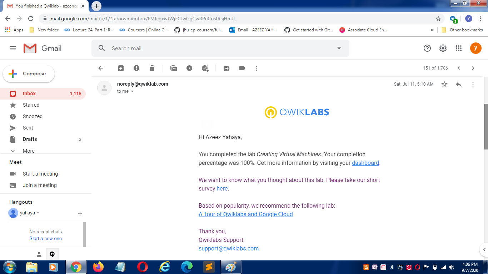
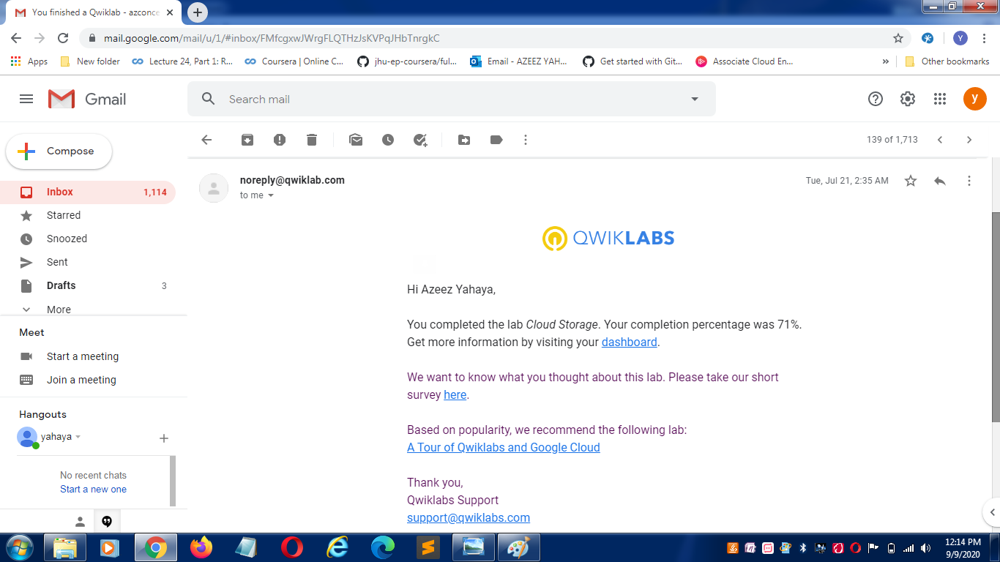

# GCPpractice-project
GADS learning phase 2 practice project

# gads-2020-practice-project
## 1. 14 Qwiklabs Screenshots

<details>
  <!-- The complete lab title goes here 👇🏾-->
  <summary>Lab 1: How to create Virtual Machines</summary>
  <!-- Provide path to the screenshot here. Example 👇🏾-->
  
</details>

<details>
  <!-- The complete lab title goes here 👇🏾-->
  <summary>Lab 2: Cloud Storage</summary>
  <!-- Provide path to the screenshot here. Example 👇🏾-->
  
</details>

<details>
  <!-- The complete lab title goes here 👇🏾-->
  <summary>Lab 3: Configuring an internal load balancer</summary>
  <!-- Provide path to the screenshot here. Example 👇🏾-->
  
</details>

<details>
  <!-- The complete lab title goes here 👇🏾-->
  <summary>Lab 4: Console and Cloud Shell</summary>
  <!-- Provide path to the screenshot here. Example 👇🏾-->
  
</details>

<details>
  <!-- The complete lab title goes here 👇🏾-->
  <summary>Lab 5: Error Reporting and Debugging</summary>
  <!-- Provide path to the screenshot here. Example 👇🏾-->
  
</details>

<details>
  <!-- The complete lab title goes here 👇🏾-->
  <summary>Lab 6: Examining Billing data with BigQuery</summary>
  <!-- Provide path to the screenshot here. Example 👇🏾-->
  
</details>


## 2 QwikLabs translated from console to command line

<details>
  <!-- The complete lab title goes here 👇🏾-->
  <summary>Lab 1: How to create Virtual Machines</summary>
  <!-- Provide path to the screenshot here. Example 👇🏾-->
  
</details>


## Cloud Console
  
```
In the Cloud Console, on the top left of the screen, select Navigation menu > Compute Engine > VM Instances:
To create a new instance, click Create.
configure the parameter of your choice when creating a new instance.
Click Create.
```

## Translation code

```
gcloud compute instances create gcelab2 --machine-type n1-standard-2 --zone us-central1-c
```


<details>
  <!-- The complete lab title goes here 👇🏾-->
  <summary>Lab 2: Cloud Storage</summary>
  <!-- Provide path to the screenshot here. Example 👇🏾-->
  
</details>

## Cloud Console
  
```
 Google Coud Storage Using the Google Console
Create a Bucket
In the Cloud Console, go to Navigation menu > Storage > Browser. Click Create Bucket:
Name: Enter a unique name for your bucket.
Storage class: Multi-Regional
Location: United States
Once you've gotten your bucket configured, click Create:
Upload an Object into the Bucket
In this section, you will add an object to your bucket. For this lab the object is an image.
1.	Use an image you have on your computer
2.	 Click Upload files.
3.	Navigate to the image on your local computer, and then click Open.
You should see the image listed in the Buckets list.
Share an Object Publicly
To create a publicly accessible URL for the object, click the drop-down menu (three vertical dots).
Select Edit permissions from the drop-down menu.
In the dialog that appears, click the + Add entry button.
Add a permission for all users by entering in the following:
•	Select Public for the Entity.
•	Enter allUsers for the Name.
•	Select Reader for the Access.
Then click Save:
Create Folders
In this section you will create a folder.
1.	Click the Create Folder link near the top of the page.
2.	Name the folder folder1, then click Create.
You should see the folder in the bucket with a folder icon to distinguish it from other objects:
Create a subfolder
Now you'll create a folder inside folder1 and upload a file to it.
1.	Click on folder1, then click Create Folder near the top of the page.
2.	Name the folder folder2, then click Create.
3.	Click on folder2.
Delete a folder
In this section, remove folder1 and its contents from your bucket.
1.	Navigate back to Buckets/[YOUR_BUCKET]. You should see folder1 listed in the bucket contents list.
2.	Check the box next to the Name, folder1, and click Delete, and then click Delete again when prompted to confirm.
folder1 and its contents are no longer in your bucket.
  
```


## Translation code

```
Create a bucket
Run the gsutil mb command and replace with a unique name to create a bucket:
gsutil mb gs://YOUR-BUCKET-NAME/

Now upload an object into a bucket.
Use the gsutil cp command to upload the image from the location where you saved it to the bucket you created:
gsutil cp image.jpg gs://YOUR-BUCKET-NAME

List contents of a bucket or folder
Use the gsutil ls command to list the contents of the bucket:
gsutil ls gs://YOUR-BUCKET-NAME

List details for an object
Use the gsutil ls command, with the -l flag to get some details about the image file you uploaded to your bucket:
gsutil ls -l gs://YOUR-BUCKET-NAME/image.jpg

Make your object publicly accessible
Use the gsutil acl ch command to grant all users read permission for the object stored in your bucket:
gsutil acl ch -u AllUsers:R gs://YOUR-BUCKET-NAME/image.jpg

Remove public access
To remove this permission, use the command:
gsutil acl ch -d AllUsers gs://YOUR-BUCKET-NAME/image.jpg

Delete objects
Use the gsutil rm command to delete an object - the image file in your bucket:
gsutil rm gs://YOUR-BUCKET-NAME/image.jpg

```

